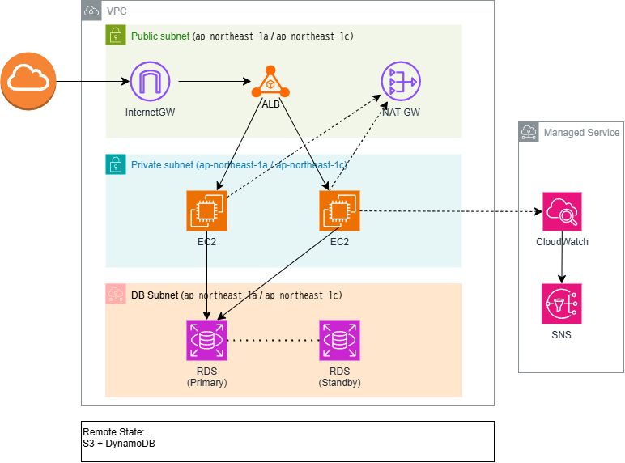

# aws-3tier-terraform

TerraformでAWS上に3層アーキテクチャを構築するポートフォリオです。

## Architecture

### 構成概要

- **Network**: VPC / Public・Private・DB Subnet（各AZ-a・AZ-c） / IGW / NAT Gateway
- **Web tier**: Application Load Balancer（HTTP 80 / HTTPS 443）
- **App tier**: EC2（Auto Scaling Group / 起動テンプレート）
- **DB tier**: RDS MySQL 8.0（Multi-AZ / gp3 / 暗号化）
- **Monitoring**: CloudWatch Alarms + SNS メール通知

## Directory Structure

    aws-3tier-terraform/
    ├── bootstrap/          # remote state用S3バケット
    ├── environments/
    │   ├── dev/            # 開発環境（10.0.0.0/16）
    │   └── prod/           # 本番環境（10.1.0.0/16）
    └── modules/
        ├── vpc/            # VPC・サブネット・IGW・NAT GW・ルートテーブル
        ├── alb/            # ALB・リスナー・ターゲットグループ・SG
        ├── ec2/            # 起動テンプレート・Auto Scaling・SG
        ├── rds/            # RDS MySQL Multi-AZ・DBサブネットグループ・SG
        └── monitoring/     # CloudWatch Alarms・SNSトピック

## Design Decisions

**環境分離**: environments/dev と environments/prod でディレクトリを分割し、S3 backend の key パスも分離することで state ファイルを完全に独立させています。

**Remote State**: Terraform v1.11 から利用可能な S3 ネイティブロック（use_lockfile = true）を採用し、DynamoDB なしでロック制御を実現しています。

**セキュリティグループ**: ALB → EC2 → RDS の順に最小権限で連鎖させており、RDS は EC2 の SG からのみ 3306 ポートを許可しています。

**NAT Gateway**: dev・prod ともに AZ-a に1台配置。冗長構成が必要な場合は各 AZ に1台追加することを想定しています。

## Monitoring

| 対象 | メトリクス | 閾値 |
|------|-----------|------|
| ALB | 5xx エラー数 | 10回/分 |
| ALB | 4xx エラー数 | 50回/分 |
| ALB | Unhealthy ホスト数 | 1台以上 |
| EC2 | CPU 使用率 | 80% |
| RDS | CPU 使用率 | 80% |
| RDS | DB 接続数 | 80以上 |
| RDS | 空きストレージ | 5GB 以下 |

## Usage

### 前提条件

- Terraform >= 1.11.0
- AWS CLI 設定済み（aws configure）
- S3 バケット作成済み（bootstrap 参照）

### Bootstrap（初回のみ）

    cd bootstrap
    terraform init
    terraform apply

### Dev 環境のデプロイ

    cd environments/dev
    terraform init
    terraform plan
    terraform apply

### 環境の削除

    terraform destroy
